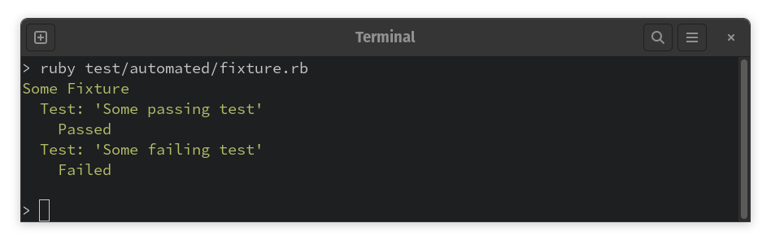
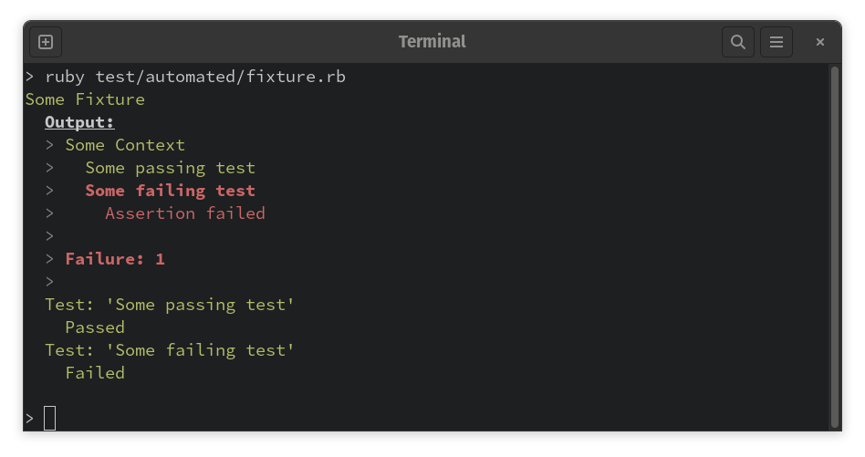
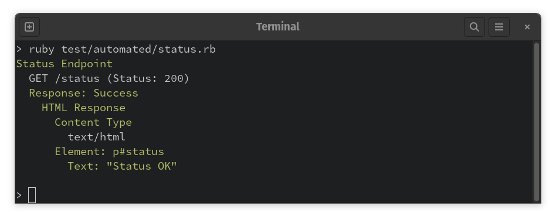
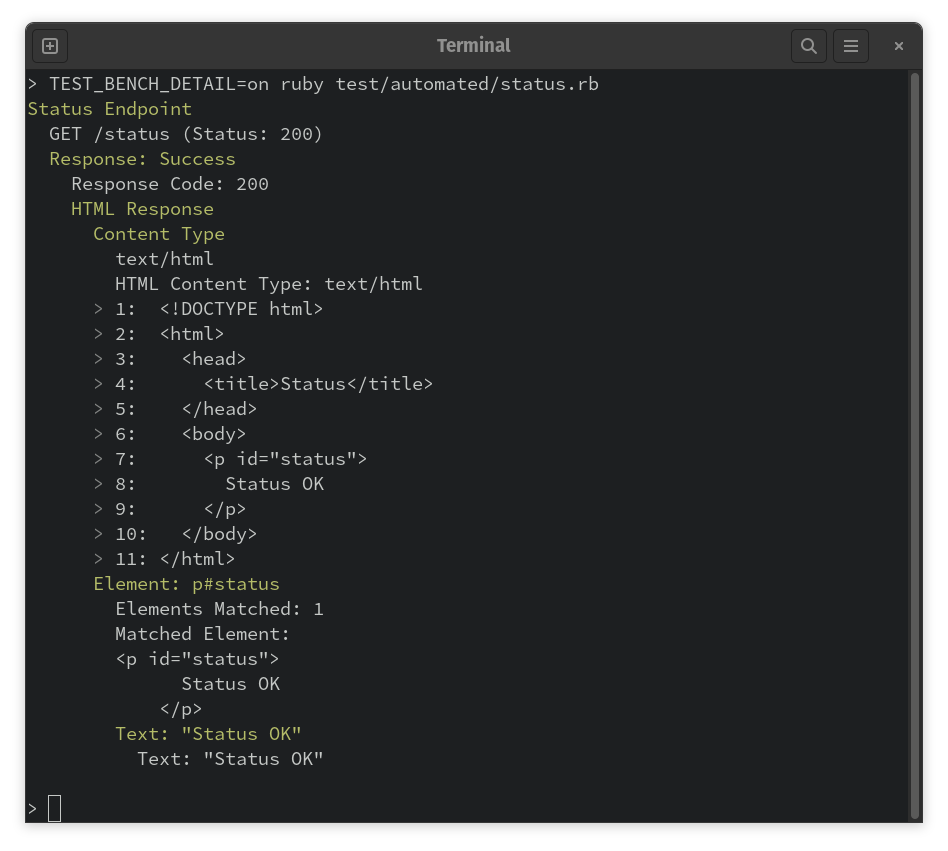

# Clearing Up The Air On TestBench Fixtures

Since TestBench was released, it's most unique and invaluable feature has also proven to be difficult to understand by most Rubyists. The confusion is entirely understandable, and I've certainly long wished for a more obvious name. To most web developers in general, "test fixture" generally connotes "YAML file with test data in it," i.e. ActiveRecord fixtures.

However, while ActiveRecord fixtures -- or fixture data, as the feature might be better called -- can be valuable for maintaining test data for some projects, the underlying concept of a test fixture predates Ruby on Rails by over a decade. From my research, it looks like Kent Beck introduced the term quite a while ago, and I understand his writing to define a "fixture" as an object that implements test behaviors that can be incorporated into tests. (See: https://live.exept.de/doc/online/english/tools/misc/testfram.htm)

Ultimately, I went with Beck's prior art here.

## Basic Fixture Declaration and Usage

In TestBench, fixtures are just test code. In fact, the easiest way to think of TestBench fixtures is that they're just Ruby objects that have access to the TestBench DSL.

To illustrate, imagine the following test file:

```ruby
context "Some Context" do
  test "Some passing test" do
    assert(true)
  end

  test "Some failing test" do
    refute(true)
  end
end
```

If we include `TestBench::Fixture` into any class, the above test code can be placed into the class verbatim and actually run! By including `TestBench::Fixture` in a class, the TestBench core methods, e.g. context, test, assert, refute, etc. all become available:

```ruby
class SomeFixture
  include TestBench::Fixture

  def call
    context "Some Context" do
      test "Some passing test" do
        assert(true)
      end

      test "Some failing test" do
        refute(true)
      end
    end
  end
end

# Instantiate and then actuate the fixture object
some_fixture = SomeFixture.new
some_fixture.()
```

However, when this code snippet is run, no output gets printed. This is because TestBench fixtures are [Useful Objects](<http://docs.eventide-project.org/user-guide/useful-objects.html>). As such, when instantiated via the initializer (in this case, `SomeFixture.new`), the fixture instances aren't connected to the main TestBench session that writes TestBench's test output. Instead, fixtures have a diagnostic substitute session by default. That substitute actually allows the fixture itself to be tested in isolation:

```ruby
context "Some Fixture" do
  some_fixture = SomeFixture.new

  some_fixture.()

  context "Test: 'Some passing test'" do
    test_passed = some_fixture.test_session.test_passed?("Some passing test")

    test "Passed" do
      assert(test_passed)
    end
  end

  context "Test: 'Some failing test'" do
    test_failed = some_fixture.test_session.test_failed?("Some failing test")

    test "Failed" do
      assert(test_failed)
    end
  end
end
```

Running the test file produces the following output:



It's also often useful to see the fixture's output inside the test. However, the output of a fixture being tested needs to be segregated from TestBench's output, otherwise it'd be impossible to distinguish the outer test file's output from the test fixture's output. There's a utility method to extract the output from a fixture that was executed with a substitute session: `TestBench::Fixture.output(some_fixture)`.

TestBench's comment and detail methods can format text that spans multiple lines as a block quote (with an optional heading), which is useful for printing test fixture output. Here's what that looks like in the fixture's test file:

```ruby
context "Some Fixture" do
  some_fixture = SomeFixture.new

  some_fixture.()

  comment "Output:", TestBench::Fixture.output(some_fixture)

  context "Test: 'Some passing test'" do
    # ...

  end
end
```

Now when the test file is run, the fixture's output is printed in a manner that is unambiguous from the test file's output:



It takes some practice to learn to distinguish between the output of the fixture being tested and the rest of the test output, but after acclimation they can be distinguished at a glance.

## Using Fixtures In Practice

By default, test fixtures are connected to a substitute session that can be used to test the fixtures themselves. To actually run a fixture and have its output included with the overall test run, use the fixture DSL method, which associates the fixture's session with the outer test file's session:

```ruby
fixture(SomeFixture)
```

If the fixture class accepts arguments, they can be supplied after the fixture class:

```ruby
class SomeOtherFixture
  include TestBench

  def initialize(arg1, arg2)
    # ...
  end
end

fixture(SomeOtherFixture, 'some-argument', 'some-other-argument')
```

## Fixtures via Protocol Discovery

There's a second form of declaring and actuating fixtures, and that is via the technique of protocol discovery. To allow this, a Ruby class needs to have a Fixture module inside its class namespace:

```ruby
class SomeClass
  attr_accessor :invoked

  def some_method
    self.invoked = true
  end

  def invoked?
    !!invoked
  end

  module Fixture
    def assert_some_method_invoked
      invoked = self.invoked?

      test "Some method invoked" do
        assert(invoked)
      end
    end
  end
end



some_object = SomeClass.new

fixture(some_object) do
  some_object.assert_some_method_invoked
end
```

In this example, both the TestBench DSL and the Fixture module get extended onto some\_object at runtime, so the test specific method assert\_some\_method\_invoked becomes available on the test subject itself.

## A Real World Example

Suppose there's a Rails application, SomeRailsApplication, with a status endpoint that indicates whether the application is available or not. The view template might look like this:

```html
<!DOCTYPE html>
<html>
  <head>
    <title>Status</title>
  </head>
  <body>
    <p id="status">
      Status <%= @status %>
    </p>
  </body>
</html>
```

Here's what a test file might look like:

```ruby
context "Status Endpoint" do
  fixture(SomeRailsApplication) do |app|
    app.get '/status'

    app.assert_success do |response|
      response.assert_html do |html|
        html.assert_element("p#status") do |status|
          status.assert_text("Status OK")
        end
      end
    end
  end
end
```

The variables `app` and `response` are actually TestBench fixtures. The implementation of `app.assert_success` invokes a Response fixture with the DSL method `fixture` , which is also available on TestBench fixtures (just like assert, context, test, comment, etc.).

The output:



This particular fixture prints out the raw HTML response as a detail, which appears when either there's a failure, or when details are explicitly activated by setting `TEST_BENCH_DETAIL`:



## Key Points

- Fixtures are just test objects, not YAML files with test data (like ActiveRecord)
- Because they're Useful Objects, TestBench fixtures can be invoked in isolation and interrogated through their test session's diagnostic substitute
- Use the fixture DSL method to actually use fixtures in a test file, or to have a fixture invoke another fixture
- Some fixtures have a call method that implements a test procedure, others are intended to accept a test procedure passed in via a block argument
- Fixtures can contain generalized test code, and even invoke other fixtures!
- Ultimately, fixtures are how TestBench can be extended. If you know TestBench, you already know how to extend TestBench!
- Details allow test files to print out pertinent information that, by default, is only shown when a test fails. Details can be turned on even for passing tests by setting `TEST_BENCH_DETAIL` to `on`
